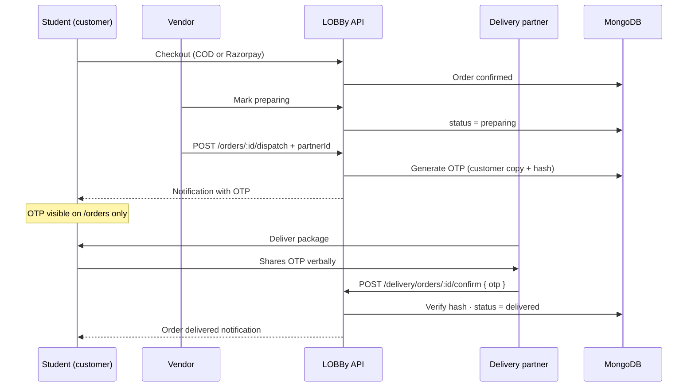
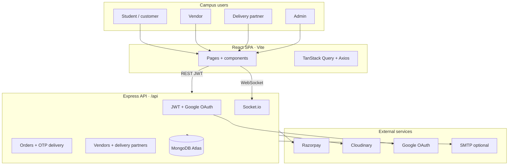
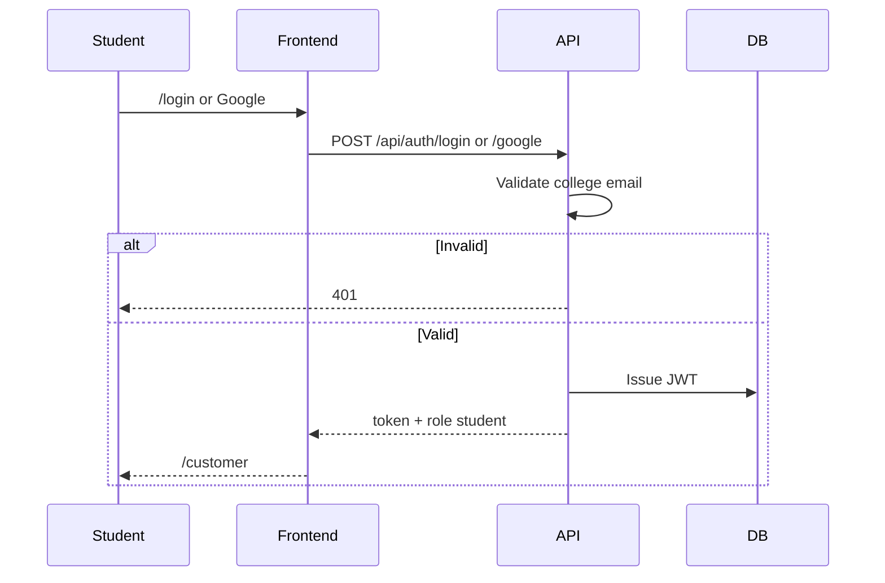
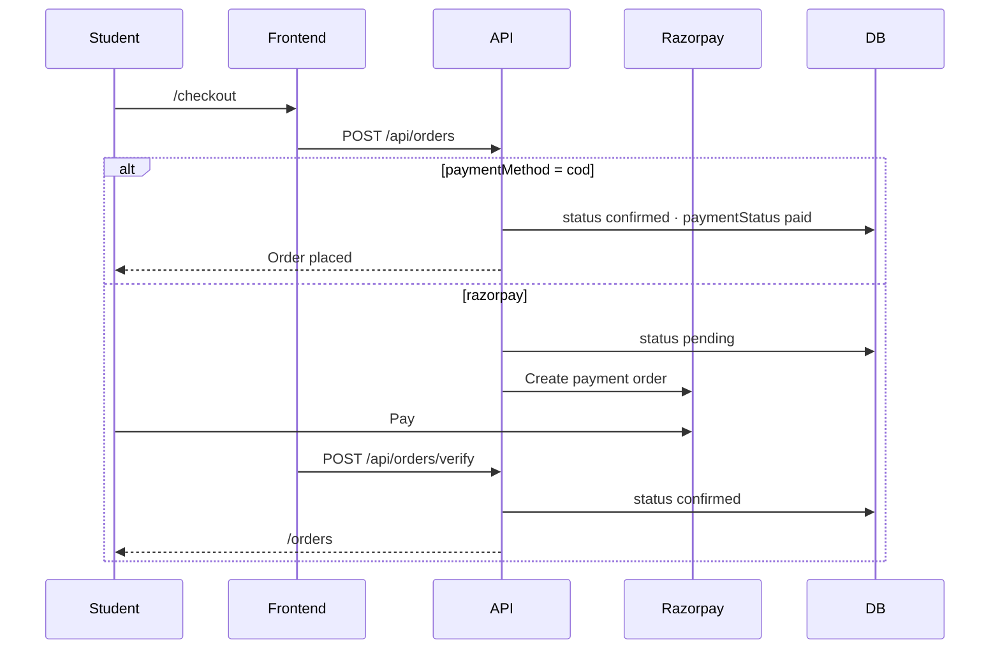
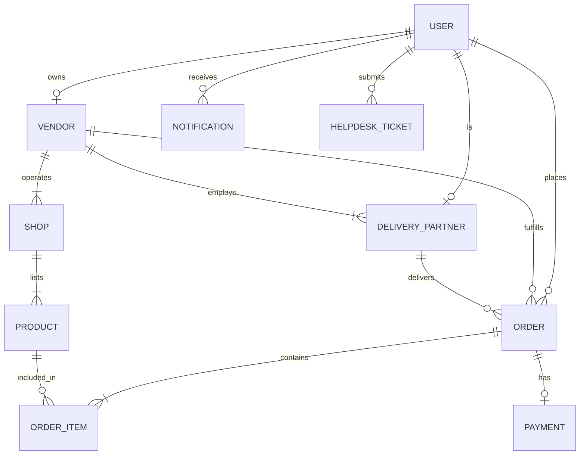

<div align="center">

# LOBBy — Campus Marketplace

**A full-stack multi-vendor marketplace for college campuses** — students shop, vendors sell, delivery partners fulfill, admins govern.

[](https://nodejs.org/)
[](https://react.dev/)
[](https://www.mongodb.com/)
[](https://expressjs.com/)

[Overview](#overview) · [Customer & delivery](#customer-order-experience) · [Architecture](#system-architecture) · [Process flows](#process-flows) · [Quick start](#quick-start) · [Demo accounts](#demo-accounts)

</div>

---

## Overview

**LOBBy** connects **students**, **approved vendors**, **delivery partners**, and **platform admins** on one campus marketplace.

| Role | Summary |
|------|---------|
| **Student (customer)** | Browse shops, cart, checkout (Razorpay or COD), track orders, receive a **delivery OTP** when the order is out for delivery, wishlist, chat, helpdesk |
| **Vendor** | Manage products and shops, process orders, assign **delivery partners**, dispatch orders (OTP is **not** visible to vendor) |
| **Delivery partner** | Vendor-managed accounts; see assigned deliveries and confirm handoff using the **OTP the customer provides** |
| **Admin** | Vendor approval, shop/product controls, analytics, platform order oversight, helpdesk |

Payments use **Razorpay** (test mode) or **COD**. Images use **Cloudinary**; alerts use in-app **notifications** and optional **SMTP**.

---

## Customer order experience

### Order status lifecycle

| Status | Meaning | Who updates it |
|--------|---------|----------------|
| `pending` | Order placed; awaiting online payment | System |
| `confirmed` | Paid (Razorpay) or COD placed | System |
| `preparing` | Vendor is packing the order | Vendor |
| `dispatched` | Handed to a delivery partner | Vendor (assigns partner) |
| `delivered` | Customer received the order | Delivery partner (OTP verified) |
| `cancelled` | Order cancelled | Vendor / admin |

### Delivery OTP (anti-cheat)

When a vendor **dispatches** an order:

1. A **6-digit OTP** is generated and stored securely (hashed for verification).
2. **Only the customer** sees the OTP:
   - In-app notification
   - **My orders** page while status is **Out for delivery**
3. **Vendors do not** see the OTP (prevents marking delivered without handoff).
4. **Delivery partners do not** see the OTP in their dashboard — they must **ask the customer** at delivery.
5. The partner enters the OTP in the **Delivery dashboard** → order becomes **Delivered**.



### Customer-facing UI

| Feature | Route | Description |
|---------|-------|-------------|
| Browse & shop | `/customer`, `/products`, `/shops` | Catalog and shop pages |
| Cart & checkout | `/cart`, `/checkout` | COD or Razorpay |
| **My orders** | `/orders` | Status labels, timeline, **delivery OTP** when dispatched |
| Profile & settings | `/profile`, `/settings` | Account preferences |
| Notifications | `/notifications` | Order updates including dispatch OTP |
| Helpdesk | `/helpdesk` | Support tickets |

---

## System architecture

LOBBy uses a **Node.js + Express** REST API with **MongoDB Atlas**, serving a **React (Vite) SPA**. Real-time chat uses **Socket.io**.



---

## Process flows

### Student login



### Checkout (COD or Razorpay)



### Vendor: orders and delivery partners

1. **Orders & delivery** tab on vendor dashboard (`/vendor`).
2. **Start preparing** → `preparing`.
3. **Dispatch** → choose an active delivery partner → `dispatched` (customer gets OTP).
4. **Delivery partners** section — vendor creates partner logins (`POST /api/vendors/delivery-partners`).

### Delivery partner login

- Portal: **`/delivery/login`**
- Dashboard: **`/delivery`** — list of dispatched assignments; enter customer OTP to confirm.

### Admin governance

- Dashboard: `/admin` — overview, vendors, shops, products, **orders** (read-only delivery metadata).
- Vendor approve/reject, shop/product toggles, CSV export, helpdesk.

### Database entity relationships



---

## Features by role

| Role | Capabilities |
|------|----------------|
| **Student** | College email + Google OAuth, browse, cart, COD/Razorpay checkout, **order tracking + delivery OTP**, wishlist, chat, helpdesk, theme toggle |
| **Vendor** | Approval-gated registration, products/shops, **order fulfillment**, **delivery partner CRUD**, dispatch (no OTP visibility), analytics CSV |
| **Delivery partner** | Vendor-created account, assigned orders, **OTP confirmation** (customer-provided code only) |
| **Admin** | Secure login, vendor approval, toggles, stats/charts, **platform orders view**, CSV, helpdesk |

---

## Tech stack

| Layer | Technologies |
|-------|----------------|
| Frontend | React 18, Vite, Tailwind, TanStack Query, React Router, Recharts |
| Backend | Node.js, Express, Mongoose, JWT, Socket.io, bcrypt OTP hashing |
| Database | MongoDB Atlas |
| Payments | Razorpay + COD |
| Media | Cloudinary |
| Auth | Email/password, Google OAuth, college domain allowlist |

---

## Database

Connection via `MONGO_URI` in `backend/.env` (see `backend/.env.example`). Health: `GET /health`.

### Key models

| Model | File | Purpose |
|-------|------|---------|
| `User` | `backend/src/models/User.js` | Roles: `student`, `vendor`, `admin`, `delivery` |
| `Vendor` | `backend/src/models/Vendor.js` | Store profile, `isApproved` |
| `DeliveryPartner` | `backend/src/models/DeliveryPartner.js` | Links `user` + `vendor`, `isActive` |
| `Shop` | `backend/src/models/Shop.js` | Vendor shops, `isOpen` |
| `Product` | `backend/src/models/Product.js` | Catalog, stock, images |
| `Order` | `backend/src/models/Order.js` | Status, tracking[], `deliveryPartner`, OTP fields |
| `Payment` | `backend/src/models/Payment.js` | Razorpay records |
| `Notification` | `backend/src/models/Notification.js` | Order alerts (incl. customer OTP on dispatch) |
| `HelpdeskTicket` | `backend/src/models/HelpdeskTicket.js` | Support |

### Order OTP fields (server-only / gated)

| Field | Visibility |
|-------|------------|
| `customerDeliveryOtp` | Returned to **order owner** only when `dispatched` |
| `deliveryOtpHash` | Never exposed to clients |
| `deliveryPartner` | Shown to customer, vendor, admin as name only |

### Seed data

```bash
cd backend
npm run seed              # Upsert demo data
npm run seed -- --reset   # Wipe core collections first
```

Creates admin, vendor, **delivery partner**, student, shops, and sample products.

---

## Project structure

```
lobby/
├── backend/
│   ├── src/
│   │   ├── controllers/   # orderController (dispatch, OTP), deliveryPartnerController
│   │   ├── models/        # Order, DeliveryPartner, User, ...
│   │   ├── routes/        # orders, delivery, vendors/delivery-partners
│   │   └── utils/         # seed.js, orderHelpers.js
│   └── .env.example
├── frontend/
│   ├── src/pages/         # OrdersPage, DeliveryDashboardPage, VendorDashboardPage, ...
│   └── .env.example
└── README.md
```

---

## Quick start

### Prerequisites

Node.js 18+, MongoDB Atlas, Razorpay test keys (optional for COD-only testing), Google OAuth optional.

### Install and run

```bash
git clone <your-repo-url>
cd lobby

cd backend && npm install && cp .env.example .env
cd ../frontend && npm install && cp .env.example .env

cd backend && npm run dev    # http://localhost:5000
cd frontend && npm run dev   # http://localhost:5173
```

### Seed demo data

```bash
cd backend
npm run seed
```

| Service | URL |
|---------|-----|
| Frontend | http://localhost:5173 |
| Backend | http://localhost:5000 |
| Health | http://localhost:5000/health |
| API docs | http://localhost:5000/api/docs |

### Environment variables

**Backend** (`backend/.env`):  
`MONGO_URI`, `JWT_SECRET`, `REFRESH_TOKEN_SECRET`, `GOOGLE_CLIENT_ID`, `COLLEGE_EMAIL_ALLOWLIST`, `RAZORPAY_KEY_ID`, `RAZORPAY_KEY_SECRET`, `CLOUDINARY_*`, `SMTP_*`, `CLIENT_URL`, `ADMIN_LOGIN_SECRET`

**Frontend** (`frontend/.env`):  
`VITE_API_BASE_URL`, `VITE_GOOGLE_CLIENT_ID`, `VITE_RAZORPAY_KEY_ID`

---

## API overview

| Prefix | Purpose |
|--------|---------|
| `/api/auth` | Login, register, Google OAuth, admin login |
| `/api/users` | Profile, cart, wishlist |
| `/api/vendors` | Vendor profile, products, analytics, **`/delivery-partners`** CRUD |
| `/api/orders` | Create, list, **`/:id/dispatch`**, **`/:id/confirm-delivery`**, verify payment |
| `/api/delivery` | Partner: **`GET /orders`**, **`POST /orders/:id/confirm`** |
| `/api/admin` | Stats, vendors, shops, products, **`GET /orders`**, CSV |
| `/api/shops`, `/api/products` | Catalog |
| `/api/notifications` | User alerts |
| `/api/chat` | Messaging |
| `/api/helpdesk` | Support tickets |

### Order endpoints (delivery)

| Method | Endpoint | Role | Description |
|--------|----------|------|-------------|
| `PUT` | `/api/orders/:id/status` | vendor, admin | `preparing`, `cancelled` |
| `POST` | `/api/orders/:id/dispatch` | vendor | Assign partner, generate customer OTP |
| `POST` | `/api/orders/:id/confirm-delivery` | delivery | Verify customer OTP → `delivered` |
| `POST` | `/api/delivery/orders/:id/confirm` | delivery | Same confirm (partner route) |

---

## Demo accounts

> Development only. Change passwords before production.

| Role | Email | Password | Notes |
|------|-------|----------|--------|
| Admin | `admin@lobby.com` | `AdminPass123` | Admin key: `Access123` at `/admin/login` |
| Vendor | `vendor@lobby.com` | `VendorPass123` | `/vendor/login` |
| Delivery partner | `delivery@lobby.com` | `DeliveryPass123` | `/delivery/login` — linked to Campus Mart |
| Student | `kanishk.053344@tmu.ac.in` | `Password123` | `/login` — college email |

| Portal | Route |
|--------|-------|
| Customer home | `/customer` |
| Student login | `/login` |
| My orders (OTP) | `/orders` |
| Vendor | `/vendor/login` |
| Delivery | `/delivery/login` |
| Admin | `/admin/login` |

### End-to-end delivery test

1. Log in as **student** → add items → **checkout (COD)**.
2. Log in as **vendor** → **Orders & delivery** → **Start preparing** → **Dispatch** → select **Campus Rider**.
3. As **student**, open **My orders** → copy **delivery OTP**.
4. Log in as **delivery@lobby.com** → enter OTP → **Confirm delivery**.
5. Refresh **My orders** → status **Delivered**.

---

<div align="center">

**LOBBy** · Campus marketplace · MERN · Razorpay · OTP delivery verification

</div>
